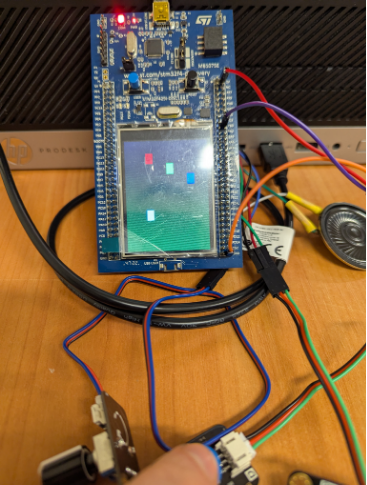
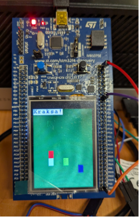

# embeded-systems-project
Projektem zaliczeniowym jest gra zręcznościowa wykonana dla płytki STM32F429ZITx. Gracz ma za zadanie omijać obiekty nadciągające z górnej krawędzi ekranu w jego stronę. W tym celu może poruszać się w lewo lub prawo. Aby zwiększyć poziom trudności dostępny jest potencjometr, który steruje prędkością poruszających się obiektów. W przypadku zderzenia głośnik wydaje dźwięk a na ekranie ukazuje się komunikat.
Projekt wykorzystuje:
- liczniki - obliczanie przesunięć i kolizji 
- podwójne buforowanie - płynny ruch
- dwa przyciski - sterowanie położeniem 
- potencjometr - prędkość poruszania
- głośnik - sygnalizacja zderzenia
## Zdjęcia

